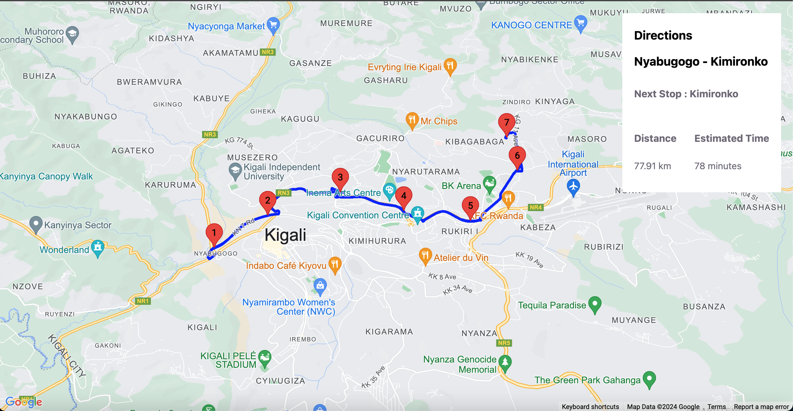
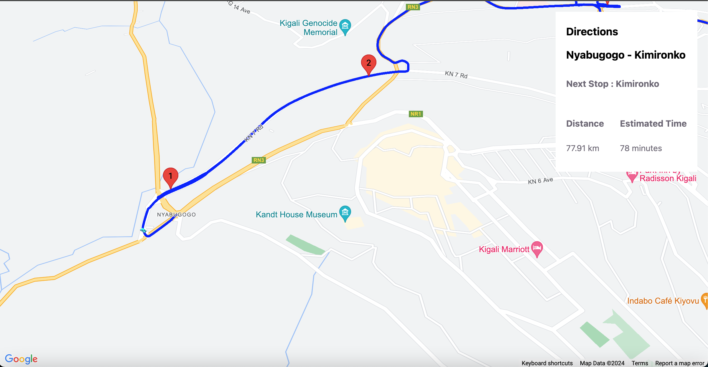
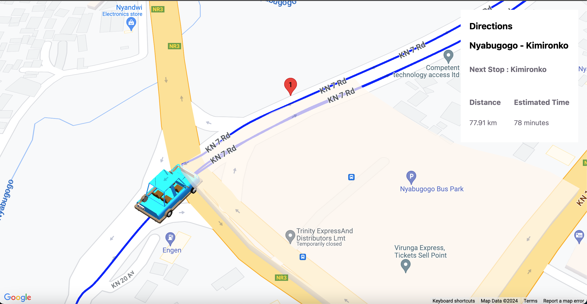
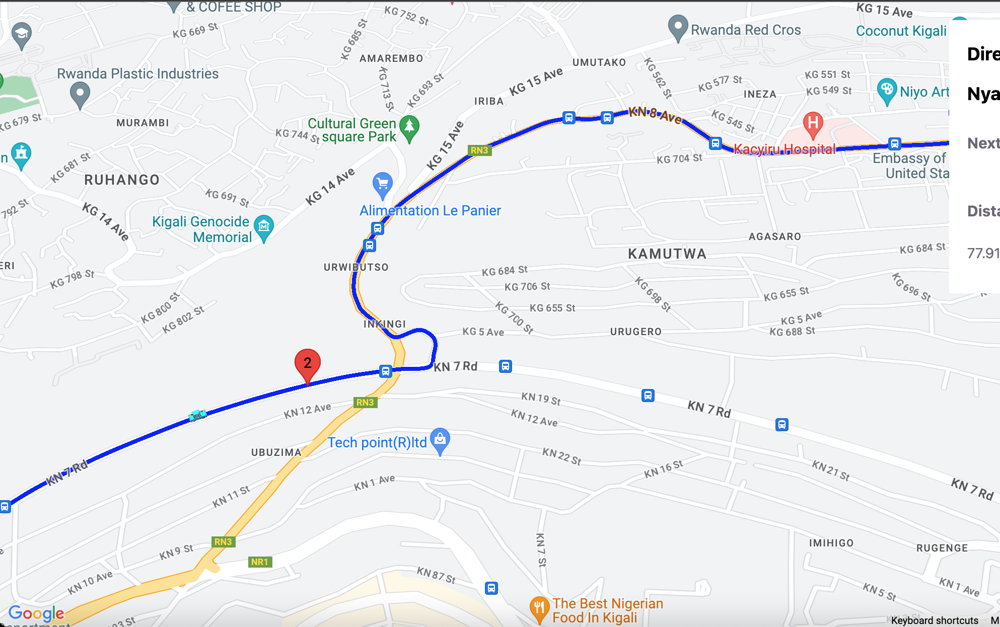
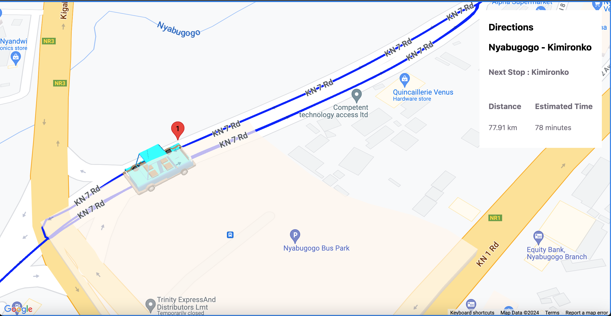
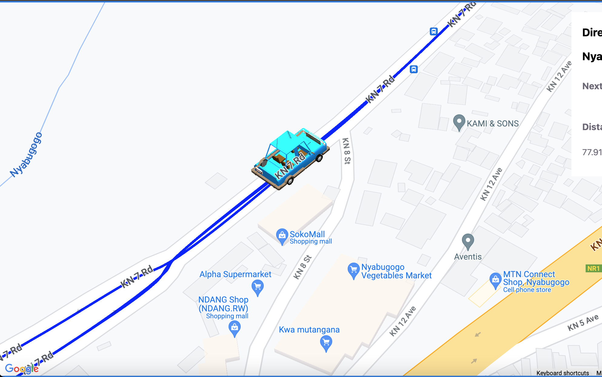

<h1> REAL-TIME RIDE-SHARE TRACKING </h1>

MY APPROACH FOR THIS APP

• I used @googlemaps/react-wrapper package for the maps wrapper and rendering google maps on the page  
• I used also @ubilabs/threejs-overlay-view for a good threejs overlay view for viewing the routes well together with three to view the map in 3D

FEATURES IN THIS APP

• An interactive map displaying the entire route with marked stops.  
• Real-time tracking of the driver's current location using A car displaying where he is following following a certain speed he/she is using  
• Showing ETA (Estimated Time of Arrival) together with the distance  
• Enhanced user experience by incorporating 3D visualization for displaying the route and the driver's progress along it.  
• Implemented error handling mechanisms, such as handling Geolocation API errors and API request failures,  

Recommended Technologies:  
* Front-end: React.js  
* Google Maps API for mapping and routing functionalities.  

SCREENSHOTS

     

# Ride-share-maps
